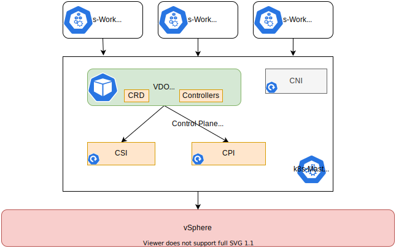

# vSphere Kubernetes Drivers Operator  

## Overview

The vSphere Kubernetes Drivers Operator project is designed to simplify and
automate the lifecycle management of CSI and CPI drivers in a Kubernetes
cluster running on vSphere. The operator exposes Custom Resources to configure
CPI and CSI drivers. To know more about the design and architecture you can see [here](docs/architecture).

## Goals

Our goal is to make vSphere the best place to run any Kubernetes and to vastly
simplify the experience of deploying Kubernetes to vSphere.

## Prerequisites

VDO has been tested on k8s cluster running versions 1.21 or later.
VDO can run on vanilla as well as openshift k8s clusters

1. vSphere 6.7U3(or later) is supported for VDO
2. Virtual Machine hardware version should be version 15(or later)
3. K8s master nodes should be able to communicate with vcenter management interface
4. Disable Swap(`swapoff -a`) on all nodes
5. Enable Disk UUID(disk.EnableUUID) on all node vm's

## Getting Started

Getting started with VDO is simple and straightforward. Please head to [Getting Started](docs/getting-started.md)

## Community

All of the exising CPI, CSI and CNI driver projects are maintained in GitHub

- [vSphere Cloud Provider](https://github.com/kubernetes/cloud-provider-vsphere)
- [vSphere CSI Storage Driver](https://github.com/kubernetes-sigs/vsphere-csi-driver)
- [vSphere Antrea CNI Driver](https://github.com/vmware-tanzu/antrea)

We really value the community of developers and vSphere users who run Kubernetes
on vSphere and our goal is to ensure that the vSphere Drivers Operator is designed
and developed 100% in the open. As such, we will be using GitHub issues for
tracking all of our work and GitHub markdown for our designs. We will be starting
a regular call where design decisions are discussed and we commit to ensuring
that decisions are well documented.

If you have an interest in contributing or submitting requirements,
we'd love to hear from you!

## Contributing

### Project Scope

This is a brand new project we are launching on GitHub, developed and designed upstream.
We will be setting up a slack channel, regular public developer meetings
and design discussions in the next few weeks.
Please watch this space.

### How to Contribute

The vSphere Kubernetes Drivers Opearator project team
welcomes contributions from the community.
If you wish to contribute code and
you have not signed our contributor license agreement (CLA),
our bot will update the issue when you open a Pull Request.
For any questions about the CLA process,
please refer to our FAQ

Please get in touch with us via Slack or
come to one of our meetings if you want to get involved.

## License

VDO is licensed under the Apache License, version 2.0
