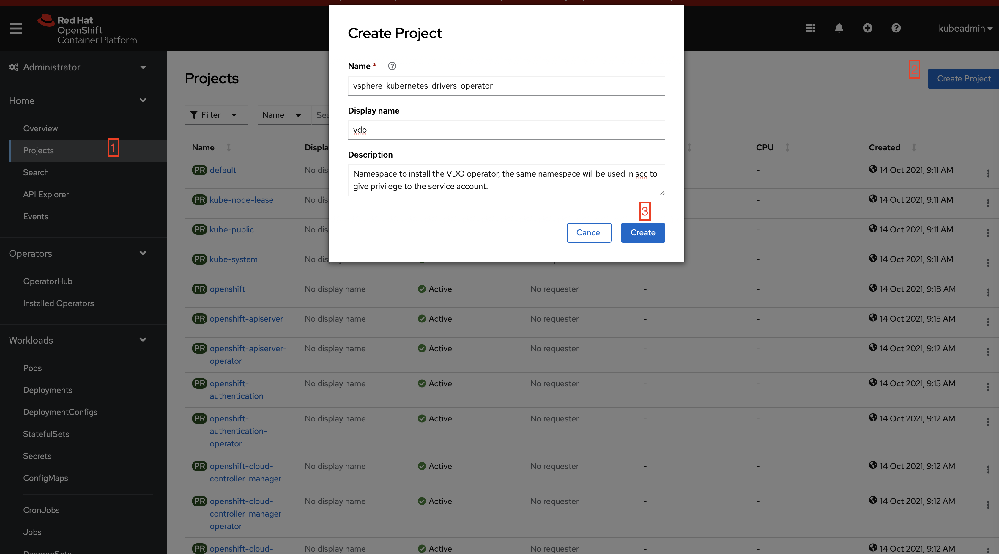
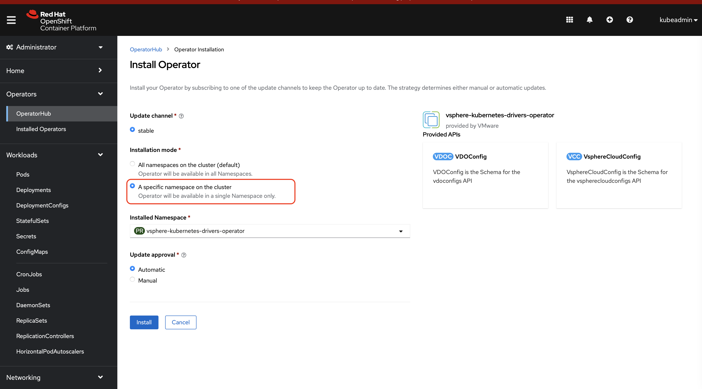

## Installation of VDO from Operator Hub

You can straight away install the vSphere-Kubernetes-drivers-operator(vdo) from OperatorHub, however to make it work 
seamlessly you need to add some SecurityContextConstraints as a cluster admin.

For installation, you can follow the below pre-requisites:

#### Pre-requisites
- **[Recommendation]** Create a project/namespace where you want to install vdo.

- **[Recommendation]** Create a `SecurityContextConstraints` which allows the `vdo-controller-manager` serviceaccount 
to have a permission of HostPath and HostNetwork Volumes in a specified namespace.
Login --> Right Side Menu (Administration) --> CustomResourceDefinitions --> Search (SecurityContextConstraints) --> Instance(From Tab) --> Create SecurityContextConstraints (Click)
The new scc should look something like this 
```shell
apiVersion: security.openshift.io/v1
kind: SecurityContextConstraints
metadata:
  name: example
allowPrivilegedContainer: true
allowHostDirVolumePlugin: true
allowHostNetwork: true
allowHostPorts: true
runAsUser:
  type: RunAsAny
seLinuxContext:
  type: RunAsAny
fsGroup:
  type: RunAsAny
users:
- system:serviceaccount:vsphere-kubernetes-drivers-operator:vdo-controller-manager
```

If you are using CSI version above 2.3.0 in compatibility matrix then your scc should have below definitions to add required capabilities and service-accounts for CSI Node.
```shell
apiVersion: security.openshift.io/v1
kind: SecurityContextConstraints
metadata:
  name: example
allowPrivilegedContainer: true
allowHostDirVolumePlugin: true
allowHostNetwork: true
allowHostPorts: true
defaultAddCapabilities:
- SYS_ADMIN
runAsUser:
  type: RunAsAny
seLinuxContext:
  type: RunAsAny
fsGroup:
  type: RunAsAny
users:
- system:serviceaccount:vsphere-kubernetes-drivers-operator:vdo-controller-manager
- system:serviceaccount:vmware-system-csi:vsphere-csi-node
```
**Note:** It's purely upto cluster admin on how to configure these settings, prime goal is to have an scc which can give access to create hostNetwork and hostPath to serviceaccount `vdo-controller-manager` for a project. 


#### Step 1
Login to Openshift Web Console and navigate to Operator Hub from Left Side Menu, click on search field and type `vsphere-kubernetes-drivers-operator`


#### Step 2
Click on install and select the namespace which has required permissions as described in pre-requisite.



With this vSphere-kubernetes-drivers-operator will be ready to use.
Now we are ready to configure the drivers, for configuring we have two options for user.
[1. Configure the CRD's via Openshift UI.](configure-via-openshift-ui.md)  
[2. Configure the CRD's via `vdoctl`](configure_drivers.md)

**Note** : The easiest way to configure VDO is through VDOCTL. we highly recommend downloading the VDO command line utility to configure VDO from our [release page.](https://github.com/vmware-tanzu/vsphere-kubernetes-drivers-operator/releases)

Once you have successfully completed the Configuration of Drivers(CSI/CPI), you can use `vdoctl status/version` command to see the status of VDO.